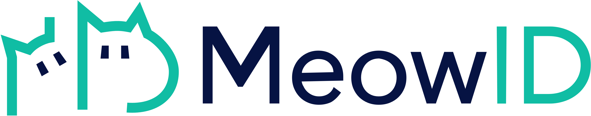
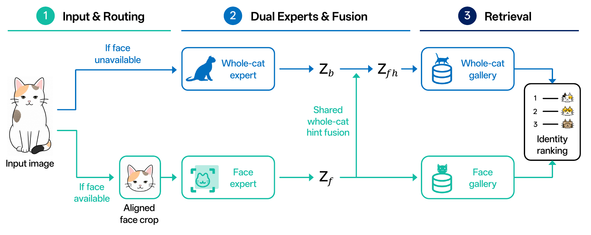

<p align="center">
  
</p>

<h1 align="center">MeowID: A Dual-Expert Retrieval System for Individual Cat Identification</h1>

<p align="center">
  
  
  
  
  
  <a href="https://huggingface.co/RicePasteM/MeowID-Base"></a>
  <a href="https://modelscope.cn/models/RicePasteM/MeowID-Base"></a>
</p>

<div align="center">
  Zhangchi Hu<sup>1,2,*,†</sup>,
  Yi Shang<sup>2,*</sup>,
  Haocheng Yang<sup>4,2,*</sup>,
  Qiwei Hu<sup>5,*</sup>,
  and Yuzheng Li<sup>3,*</sup>
</div>

<p></p>

<div align="center"><sub>
  <sup>1</sup> Department of Electronic Engineering and Information Science, University of Science and Technology of China<br>
  <sup>2</sup> School of Intelligent Software Engineering, Hefei University of Technology<br>
  <sup>3</sup> School of Software Engineering, Sun Yat-sen University<br>
  <sup>4</sup> School of Computer Science, Northwestern Polytechnical University<br>
  <sup>5</sup> College of Biological Sciences and Technology, Beijing Forestry University<br>
</sub></div>

<p align="center">
  <sup>*</sup> Equal contribution &nbsp;&nbsp; <sup>†</sup> Project leader
</p>

MeowID combines separately parameterized face and whole-cat experts in a face-priority retrieval framework. Route-specific galleries support scalable enrollment of new identities without retraining the recognition models.

## Highlights

- **Route-aware identification** — automatically selects the face or whole-cat retrieval path for each image.
- **Dual-expert representation** — preserves face-specific detail while using global appearance as contextual evidence.
- **Persistent identity registry** — enrolls one or more reference images per cat and stores normalized 512-dimensional embeddings on disk.
- **Multiple inference backends** — exposes the same Python and CLI interfaces for PyTorch, ONNX Runtime, and TensorRT.
- **Cat extraction pipeline** — uses ECSeg-X instance segmentation to produce clean, padded whole-cat crops.
- **Training and deployment tooling** — includes configuration validation, distributed training, model export, verification, and benchmarking utilities.

## Method pipeline

<p align="center">
  
</p>

<p align="center"><em>MeowID uses face-priority routing, dual recognition experts, validation-guided whole-cat hint fusion, and route-specific retrieval galleries.</em></p>

## Installation

Clone the repository, create an isolated Python environment, and install the project in editable mode:

```bash
python -m venv .venv
source .venv/bin/activate
python -m pip install --upgrade pip
pip install -e .
```

Install the extras required by your workflow:

```bash
# PyTorch inference with face detection and whole-cat cropping
pip install -e ".[ecpose,ecseg]"

# ONNX Runtime GPU deployment
pip install -e ".[onnx,ecpose,ecseg]"

# ONNX Runtime CPU deployment
pip install -e ".[onnx-cpu,ecpose,ecseg]"

# TensorRT deployment
pip install -e ".[tensorrt,ecpose,ecseg]"

# Development and tests
pip install -e ".[dev]"
```

CUDA, ONNX Runtime, and TensorRT must be compatible with the selected backend and the host GPU. The reference deployment was verified on Linux x86_64 with Python 3.10, CUDA 12.4, PyTorch 2.4.1, TensorRT 10.8, and an NVIDIA RTX 3090.

## Model artifacts

`MeowID` accepts an artifact directory containing `deployment.json` and the recognition and pose models for the selected backend:

```text
artifacts/
├── MeowID-Base/
│   ├── deployment.json
│   ├── meowid_base.pth
│   ├── meowid_base.onnx
│   ├── meowid_base.engine
│   ├── ecpose.pth
│   ├── ecpose.onnx
│   ├── ecpose.engine
│   └── SHA256SUMS
├── ECSeg/
│   ├── deployment.json
│   ├── ecseg_x.safetensors
│   └── SHA256SUMS
└── training_init/
    ├── body_expert.pth
    ├── face_expert.pth
    └── SHA256SUMS
```

Large model binaries are hosted outside regular Git and mirrored in both repositories:

- [Hugging Face — RicePasteM/MeowID-Base](https://huggingface.co/RicePasteM/MeowID-Base)
- [ModelScope — RicePasteM/MeowID-Base](https://modelscope.cn/models/RicePasteM/MeowID-Base)

Verify model files before inference or training:

```bash
(cd artifacts/MeowID-Base && sha256sum -c SHA256SUMS)
(cd artifacts/ECSeg && sha256sum -c SHA256SUMS)
(cd artifacts/training_init && sha256sum -c SHA256SUMS)
```

TensorRT engines are tied to the TensorRT version and GPU architecture used to build them. Rebuild an engine from the ONNX artifacts when deploying to a different environment.

## Quick start

Run the bundled five-cat ICW example to build a small gallery and retrieve one
held-out query for each identity:

```bash
python examples/quickstart.py --backend torch --device cuda:0
```

The example uses `000000.jpg` as the query and the other five images as the
registration gallery for each cat. It rebuilds an isolated registry under
`outputs/icw-five-cat-registry` on every run and reports Top-1 accuracy over the
five queries. Select `onnx` or `tensorrt` with `--backend` when the corresponding
artifacts and runtime are available.

The same workflow through the Python API is:

```python
from pathlib import Path

from cat_recognition import MeowID

sample_root = Path("examples/icw_sample")
model = MeowID(
    "artifacts/MeowID-Base",
    backend="torch",
    registry="outputs/icw-five-cat-registry",
)

model.registry.clear()
for identity_dir in sorted(path for path in sample_root.iterdir() if path.is_dir()):
    gallery = sorted(identity_dir.glob("00000[1-5].jpg"))
    model.register(identity_dir.name, gallery, save=False)
model.save_registry()

query = sample_root / "00001380/000000.jpg"
prediction = model.search(query, top_k=5)[0]
print(prediction.matches[0].cat_id, prediction.matches[0].score)
```

The registry is persisted as `registry.json` and `embeddings.npz`. Register several views of each cat when possible; images with usable faces contribute to both route-specific galleries, while face-unavailable images contribute to the whole-cat gallery.

### Supported inputs

Most image-facing APIs accept any of the following:

- a file path, directory, or glob pattern;
- a `PIL.Image.Image`;
- an RGB NumPy array;
- a list or other iterable of supported inputs.

## Python API

### Detect and align cat faces

```python
detections = model.detect("images/*.jpg")
aligned_faces = model.align("images/*.jpg")
```

Each detection contains the selected face score, label, and keypoints. Alignment uses the same profile as training and returns `None` when no usable face is detected.

### Extract route-aware embeddings

```python
embeddings = model.embed(["images/a.jpg", "images/b.jpg"])

for item in embeddings:
    print(item.source, item.route, item.embedding.shape)
```

`embed()` and its alias `extract_embeddings()` return normalized 512-dimensional representations with route metadata.

### Manage identities

```python
model.register("cat_002", "images/cat_002/*.jpg")
model.remove("cat_002")

model.save_registry("registries/backup")
model.load_registry("registries/backup")
```

Use `replace=True` with `register()` to replace an identity's existing entries. Registry search uses exact inner-product ranking; because embeddings are L2-normalized, scores are cosine similarities.

### Search with an acceptance threshold

```python
results = model.search(
    "images/query.jpg",
    top_k=10,
    threshold=0.45,
)
```

Thresholds are deployment-specific. Calibrate them on images captured under the target camera, distance, lighting, occlusion, and gallery size; do not treat the included offline benchmark as an operating threshold.

## Whole-cat cropping

`CatCropper` is a standalone ECSeg-X wrapper, so segmentation can be used without loading the recognition and pose models:

```python
from cat_recognition import CatCropper

cropper = CatCropper(
    "artifacts/ECSeg",
    device="cuda:0",
    threshold=0.4,
)

results = cropper.crop(
    "images/group_photo.jpg",
    top_k=3,
    output_size=512,
    padding=0.06,
    mask_background=True,
)

for index, cat in enumerate(results[0].cats):
    cat.crop.save(f"cat_{index}.png")
```

Each cat result includes its confidence score, bounding box, segmentation mask, crop box, and PIL crop. `MeowID.crop_cats()` provides the same capability through a lazily loaded cropper.

## Command-line interface

Installing the package exposes the `meowid` command.

### Register and search

```bash
meowid register cat_001 images/cat_001/*.jpg \
  --model artifacts/MeowID-Base \
  --backend tensorrt \
  --device cuda:0 \
  --registry registries/demo

meowid search images/query.jpg \
  --model artifacts/MeowID-Base \
  --backend tensorrt \
  --device cuda:0 \
  --registry registries/demo \
  --top-k 16
```

### Extract embeddings

```bash
meowid embed images/*.jpg \
  --model artifacts/MeowID-Base \
  --backend torch \
  --device cuda:0
```

### Crop cats

```bash
meowid crop images/*.jpg \
  --model artifacts/ECSeg \
  --device cuda:0 \
  --output-dir outputs/crops \
  --top-k 3 \
  --output-size 512
```

All inference commands emit structured JSON metadata to standard output.

## Export for deployment

Export ECPose and MeowID-Base together:

```bash
# Export ONNX and TensorRT artifacts
meowid export \
  --format all \
  --repo-root "$PWD" \
  --output-dir artifacts/MeowID-Base \
  --min-batch 1 \
  --opt-batch 4 \
  --max-batch 16
```

Use `--fp32` to disable the default TensorRT FP16 build and `--no-onnxslim` to skip ONNXSlim optimization.

| Backend | Device | Notes |
| --- | --- | --- |
| PyTorch | CPU / CUDA | Reference backend and training-compatible runtime |
| ONNX Runtime | CPU / CUDA | Portable graph runtime; install the matching optional extra |
| TensorRT | CUDA | Lowest measured latency in the reference environment; engines are environment-specific |

## Reference results

Offline retrieval on the ICW test set:

| Route | Top-1 | mAP |
| --- | ---: | ---: |
| Whole-cat expert | 51.34% | 59.00% |
| Cat-face expert | 78.80% | 83.32% |
| MeowID-Base hard routing | **75.93%** | **80.45%** |

End-to-end batch-1 measurements on one RTX 3090 over 2,846 ICW test images include image decoding, preprocessing, ECPose, alignment, embedding extraction, and routing, but exclude model loading:

| Backend | Mean latency | Throughput |
| --- | ---: | ---: |
| PyTorch FP32 | 94.23 ms | 10.61 images/s |
| ONNX Runtime CPU | 478.67 ms | 2.09 images/s |
| ONNX Runtime CUDA | 79.88 ms | 12.51 images/s |
| TensorRT FP16 | **60.00 ms** | **16.66 images/s** |

These numbers describe the included evaluation setup, not guaranteed production performance. Re-run `tools/benchmark_deployment.py` on the intended hardware and workload.

## Training and reproduction

The default experiment pairs whole-cat images with aligned face crops by identity:

```text
data/icw_split/{train,val,test}/<cat_id>/*.jpg
data/icw_catface_aligned_petface_tight_v1/{train,val,test}/<cat_id>/*.jpg
```

Validate data, expert checkpoints, label mappings, and model construction before training:

```bash
python tools/validate_training_setup.py \
  --data-root /path/to/icw_split \
  --face-root /path/to/icw_catface_aligned_petface_tight_v1
```

Launch the default four-GPU experiment:

```bash
PYTHON_BIN=/path/to/python \
CUDA_VISIBLE_DEVICES=0,1,2,3 \
NPROC_PER_NODE=4 \
bash train_meowid_base.sh \
  --cfg-options \
  data.root=/path/to/icw_split \
  data.face_root=/path/to/icw_catface_aligned_petface_tight_v1
```

The primary experiment configuration is [`configs/experiments/meowid_base.yaml`](configs/experiments/meowid_base.yaml). See the [training guide](docs/TRAINING.md) for initialization requirements, checkpoint selection, evaluation, and resume behavior.

## Validation

Run the unit tests:

```bash
pytest -q
```

Verify a deployment artifact set:

```bash
python tools/verify_deployment.py \
  --artifact-dir artifacts/MeowID-Base \
  --backend tensorrt \
  --device cuda:0
```

The [validation report](docs/VALIDATION_REPORT.md) records the reference environment and completed smoke, export, parity, registry, and training-pipeline checks.

## Repository layout

```text
.
├── artifacts/                  # Manifests, checksums, and local model files
├── configs/                    # Dataset, model, and experiment configuration
├── docs/                       # Training, deployment, cropping, and validation notes
├── examples/                   # Minimal runnable examples
├── src/cat_recognition/        # Public API, inference backends, registry, and training code
├── tests/                      # Deployment and training-pipeline tests
├── third_party/EdgeCrafter/    # ECPose and ECSeg integrations
├── tools/                      # Export, verification, preparation, evaluation, and benchmark tools
└── train_meowid_base.sh        # Distributed training launcher
```

## Operational notes and limitations

- Face and whole-cat galleries represent different embedding spaces. Do not merge them or compare their scores directly.
- The bundled registry performs exact in-memory search and is intended for local or moderate-size galleries. Integrate a vector index for larger deployments.
- Registry persistence does not provide cross-process file locking. Serialize writes when multiple workers share one registry.
- Open-set thresholds must be calibrated for the deployment domain and monitored as the gallery changes.
- TensorRT engines should be rebuilt after changing GPU architecture, TensorRT version, model artifacts, or batch profiles.
- ECSeg-X cropping currently uses the PyTorch backend.

## License

A project-level license has not yet been added to this repository. Until licensing terms are published, do not assume permission to copy, redistribute, or use the project beyond the rights granted by applicable law. Third-party components remain subject to their respective licenses.
