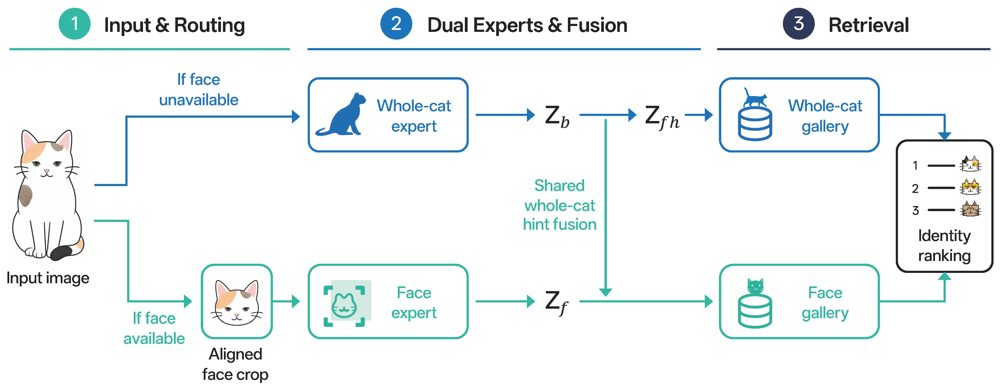

<p align="right">
  <a href="README.md">English</a> | <a href="README_zh.md">简体中文</a> | <strong>日本語</strong>
</p>

<p align="center">
  
</p>

<h1 align="center">MeowID: 猫個体識別のためのデュアルエキスパート検索システム</h1>

<p align="center">
  
  
  
  
  
  <a href="https://huggingface.co/RicePasteM/MeowID-Base"></a>
  <a href="https://modelscope.cn/models/RicePasteM/MeowID-Base"></a>
</p>

<div align="center">
  胡张驰<sup>1,2,*,†</sup>,
  尚艺<sup>2,*</sup>,
  杨皓程<sup>4,2,*</sup>,
  胡琪伟<sup>5,*</sup>,
  和 李煜政<sup>3,*</sup>
</div>

<p></p>

<div align="center"><sub>
  <sup>1</sup> 中国科学技術大学 電子工学・情報科学科<br>
  <sup>2</sup> 合肥工業大学 知能ソフトウェア工学院<br>
  <sup>3</sup> 中山大学 ソフトウェア工学院<br>
  <sup>4</sup> 西北工業大学 コンピュータ学院<br>
  <sup>5</sup> 北京林業大学 生物科学・技術学院<br>
</sub></div>

<br>

<p align="center">
  <sup>*</sup> 同等貢献 &nbsp;&nbsp; <sup>†</sup> プロジェクトリーダー
</p>

MeowID は、個別にパラメータ化された顔エキスパートと全身エキスパートを顔優先検索フレームワークに統合します。ルート専用の検索ギャラリーにより、認識モデルを再学習することなく、新しい個体をスケーラブルに登録できます。

## ハイライト

- **ルート認識型識別** — 各画像に対して顔または全身の検索パスを自動的に選択します。
- **デュアルエキスパート表現** — 顔固有の詳細を保持しながら、グローバルな外観を文脈証拠として活用します。
- **永続的個体レジストリ** — 猫ごとに1枚以上の参照画像を登録し、正規化された512次元の埋め込みベクトルをディスクに保存します。
- **複数推論バックエンド** — PyTorch、ONNX Runtime、TensorRT に対して統一された Python および CLI インターフェースを提供します。
- **猫抽出パイプライン** — ECSeg-X インスタンスセグメンテーションを使用して、クリーンでパディングされた全身猫クロップを生成します。
- **学習・デプロイツール** — 設定検証、分散学習、モデルエクスポート、検証、ベンチマークユーティリティを含みます。

## 手法パイプライン

<p align="center">
  
</p>

<p align="center"><em>MeowID は顔優先ルーティング、デュアル認識エキスパート、検証誘導型全身ヒント融合、およびルート専用検索ギャラリーを使用します。</em></p>

## インストール

リポジトリをクローンし、隔離された Python 環境を作成して、プロジェクトを編集可能モードでインストールします：

```bash
python -m venv .venv
source .venv/bin/activate
python -m pip install --upgrade pip
pip install -e .
```

ワークフローに必要な追加パッケージをインストールします：

```bash
# PyTorch 推論（顔検出・全身猫クロップ付き）
pip install -e ".[ecpose,ecseg]"

# ONNX Runtime GPU デプロイ
pip install -e ".[onnx,ecpose,ecseg]"

# ONNX Runtime CPU デプロイ
pip install -e ".[onnx-cpu,ecpose,ecseg]"

# TensorRT デプロイ
pip install -e ".[tensorrt,ecpose,ecseg]"

# 開発・テスト
pip install -e ".[dev]"
```

CUDA、ONNX Runtime、TensorRT は選択したバックエンドとホスト GPU に互換性がある必要があります。リファレンスデプロイは Linux x86_64、Python 3.10、CUDA 12.4、PyTorch 2.4.1、TensorRT 10.8、NVIDIA RTX 3090 で検証されています。

## モデルファイル

`MeowID` は `deployment.json` と、選択したバックエンド用の認識・姿勢モデルを含むモデルディレクトリを受け入れます：

```text
artifacts/
├── MeowID-Base/
│   ├── deployment.json
│   ├── meowid_base.pth
│   ├── meowid_base.onnx
│   ├── meowid_base.engine
│   ├── ecpose.pth
│   ├── ecpose.onnx
│   ├── ecpose.engine
│   └── SHA256SUMS
├── ECSeg/
│   ├── deployment.json
│   ├── ecseg_x.safetensors
│   └── SHA256SUMS
└── training_init/
    ├── body_expert.pth
    ├── face_expert.pth
    └── SHA256SUMS
```

大規模なモデルファイルは Git の外部でホストされ、両方のリポジトリにミラーされています：

- [Hugging Face — RicePasteM/MeowID-Base](https://huggingface.co/RicePasteM/MeowID-Base)
- [ModelScope — RicePasteM/MeowID-Base](https://modelscope.cn/models/RicePasteM/MeowID-Base)

TensorRT エンジンはビルド時の TensorRT バージョンと GPU アーキテクチャに依存します。異なる環境にデプロイする場合は、ONNX ファイルからエンジンを再ビルドしてください。

## クイックスタート

付属の5匹の猫 ICW サンプルを実行して、小さなギャラリーを構築し、各猫の保留クエリを検索します：

```bash
python examples/quickstart.py --backend torch --device cuda:0
```

このサンプルでは `000000.jpg` をクエリとして、残りの5枚の画像を各猫の登録ギャラリーとして使用します。実行ごとに `outputs/icw-five-cat-registry` 以下に隔離されたレジストリを再構築し、5つのクエリに対する Top-1 精度を報告します。対応するモデルファイルとランタイムが利用可能な場合、`--backend` で `onnx` または `tensorrt` を選択できます。

Python API による同じワークフローは以下の通りです：

```python
from pathlib import Path

from cat_recognition import MeowID

sample_root = Path("examples/icw_sample")
model = MeowID(
    "artifacts/MeowID-Base",
    backend="torch",
    registry="outputs/icw-five-cat-registry",
)

model.registry.clear()
for identity_dir in sorted(path for path in sample_root.iterdir() if path.is_dir()):
    gallery = sorted(identity_dir.glob("00000[1-5].jpg"))
    model.register(identity_dir.name, gallery, save=False)
model.save_registry()

query = sample_root / "00001380/000000.jpg"
prediction = model.search(query, top_k=5)[0]
print(prediction.matches[0].cat_id, prediction.matches[0].score)
```

レジストリは `registry.json` と `embeddings.npz` として永続化されます。可能な限り各猫の複数のアングルの画像を登録してください。使用可能な顔がある画像は両方のルート専用ギャラリーに貢献し、顔が利用できない画像は全身ギャラリーに貢献します。

### サポートされる入力形式

ほとんどの画像向け API は以下のいずれかを受け入れます：

- ファイルパス、ディレクトリ、または glob パターン；
- `PIL.Image.Image`；
- RGB NumPy 配列；
- リストまたはその他のサポートされる入力のイテラブル。

## Python API

### 猫の顔を検出して整列

```python
detections = model.detect("images/*.jpg")
aligned_faces = model.align("images/*.jpg")
```

各検出結果には、選択された顔スコア、ラベル、キーポイントが含まれます。整列は学習時と同じプロファイルを使用し、使用可能な顔が検出されない場合は `None` を返します。

### ルート認識型埋め込みの抽出

```python
embeddings = model.embed(["images/a.jpg", "images/b.jpg"])

for item in embeddings:
    print(item.source, item.route, item.embedding.shape)
```

`embed()` およびそのエイリアス `extract_embeddings()` は、ルートメタデータ付きの正規化された512次元表現を返します。

### 個体の管理

```python
model.register("cat_002", "images/cat_002/*.jpg")
model.remove("cat_002")

model.save_registry("registries/backup")
model.load_registry("registries/backup")
```

`register()` で `replace=True` を使用すると、個体の既存エントリを置き換えます。レジストリ検索は正確な内積ランキングを使用します。埋め込みは L2 正規化されているため、スコアはコサイン類似度です。

### 受容閾値付き検索

```python
results = model.search(
    "images/query.jpg",
    top_k=10,
    threshold=0.45,
)
```

閾値はデプロイ環境に固有です。ターゲットのカメラ、距離、照明、遮蔽、ギャラリーサイズの条件下でキャプチャされた画像でキャリブレーションしてください。含まれているオフラインベンチマークを運用閾値として扱わないでください。

## 全身猫クロップ

`CatCropper` はスタンドアロンの ECSeg-X ラッパーであり、認識モデルや姿勢モデルを読み込まずにセグメンテーションを使用できます：

```python
from cat_recognition import CatCropper

cropper = CatCropper(
    "artifacts/ECSeg",
    device="cuda:0",
    threshold=0.4,
)

results = cropper.crop(
    "images/group_photo.jpg",
    top_k=3,
    output_size=512,
    padding=0.06,
    mask_background=True,
)

for index, cat in enumerate(results[0].cats):
    cat.crop.save(f"cat_{index}.png")
```

各猫の結果には、信頼度スコア、バウンディングボックス、セグメンテーションマスク、クロップボックス、PIL クロップが含まれます。`MeowID.crop_cats()` は遅延読み込みされるクロッパーを通じて同じ機能を提供します。

## コマンドラインインターフェース

パッケージをインストールすると `meowid` コマンドが利用可能になります。

### 登録と検索

```bash
meowid register cat_001 images/cat_001/*.jpg \
  --model artifacts/MeowID-Base \
  --backend tensorrt \
  --device cuda:0 \
  --registry registries/demo

meowid search images/query.jpg \
  --model artifacts/MeowID-Base \
  --backend tensorrt \
  --device cuda:0 \
  --registry registries/demo \
  --top-k 16
```

### 埋め込みの抽出

```bash
meowid embed images/*.jpg \
  --model artifacts/MeowID-Base \
  --backend torch \
  --device cuda:0
```

### 猫のクロップ

```bash
meowid crop images/*.jpg \
  --model artifacts/ECSeg \
  --device cuda:0 \
  --output-dir outputs/crops \
  --top-k 3 \
  --output-size 512
```

すべての推論コマンドは構造化された JSON メタデータを標準出力に出力します。

## デプロイ用エクスポート

ECPose と MeowID-Base を同時にエクスポートします：

```bash
# ONNX と TensorRT ファイルをエクスポート
meowid export \
  --format all \
  --repo-root "$PWD" \
  --output-dir artifacts/MeowID-Base \
  --min-batch 1 \
  --opt-batch 4 \
  --max-batch 16
```

`--fp32` でデフォルトの TensorRT FP16 ビルドを無効化し、`--no-onnxslim` で ONNXSlim 最適化をスキップします。

| バックエンド | デバイス | 備考 |
| --- | --- | --- |
| PyTorch | CPU / CUDA | リファレンスバックエンド、学習互換ランタイム |
| ONNX Runtime | CPU / CUDA | ポータブルグラフランタイム；対応するオプション依存をインストール |
| TensorRT | CUDA | リファレンス環境で最も低いレイテンシを計測；エンジンは環境固有 |

## リファレンス結果

ICW テストセットでのオフライン検索結果：

| ルート | Top-1 | mAP |
| --- | ---: | ---: |
| 全身エキスパート | 51.34% | 59.00% |
| 猫顔エキスパート | 78.80% | 83.32% |
| MeowID-Base ハードルーティング | **75.93%** | **80.45%** |

1台の RTX 3090 上で 2,846 枚の ICW テスト画像に対するエンドツーエンドのバッチ1測定（画像デコード、前処理、ECPose、整列、埋め込み抽出、ルーティングを含み、モデル読み込みを除く）：

| バックエンド | 平均レイテンシ | スループット |
| --- | ---: | ---: |
| PyTorch FP32 | 94.23 ms | 10.61 枚/秒 |
| ONNX Runtime CPU | 478.67 ms | 2.09 枚/秒 |
| ONNX Runtime CUDA | 79.88 ms | 12.51 枚/秒 |
| TensorRT FP16 | **60.00 ms** | **16.66 枚/秒** |

これらの数値は内蔵評価環境での結果であり、本番環境のパフォーマンスを保証するものではありません。対象のハードウェアとワークロードで `tools/benchmark_deployment.py` を再実行してください。

## 学習と再現

デフォルトの実験では、全身猫画像と整列済み顔クロップを個体ごとにペアリングします：

```text
data/icw_split/{train,val,test}/<cat_id>/*.jpg
data/icw_catface_aligned_petface_tight_v1/{train,val,test}/<cat_id>/*.jpg
```

学習前にデータ、エキスパートチェックポイント、ラベルマッピング、モデル構築を検証します：

```bash
python tools/validate_training_setup.py \
  --data-root /path/to/icw_split \
  --face-root /path/to/icw_catface_aligned_petface_tight_v1
```

デフォルトの4 GPU 実験を起動します：

```bash
PYTHON_BIN=/path/to/python \
CUDA_VISIBLE_DEVICES=0,1,2,3 \
NPROC_PER_NODE=4 \
bash train_meowid_base.sh \
  --cfg-options \
  data.root=/path/to/icw_split \
  data.face_root=/path/to/icw_catface_aligned_petface_tight_v1
```

## 検証

ユニットテストを実行します：

```bash
pytest -q
```

デプロイファイルセットを検証します：

```bash
python tools/verify_deployment.py \
  --artifact-dir artifacts/MeowID-Base \
  --backend tensorrt \
  --device cuda:0
```